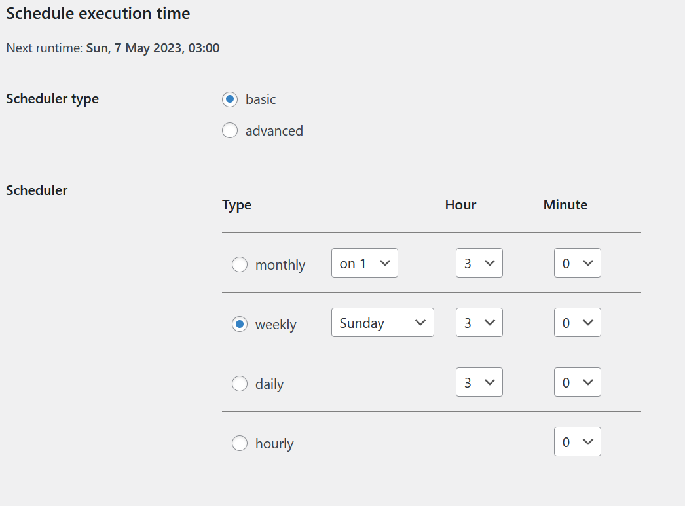

# Deployment Workflow
## Stage & Live
- Staging site
  - For staging site, we require admin/user to use `localhost` as staging site.
- Live site
  - Our live server is at: https://baizonnlearning.click
## Project management
Tools we are using:
- [GitHub Projects](https://github.com/orgs/CMS-A2-Group-J/projects/1)
  - For porject management, we create a new iteration every week, then add and update tasks to indicate development progess.
- [Discord](https://discord.gg/82SSbSvv)
  - We are using discord for all group communication activities, including daily standup, collaboration works, and sharing resource materials.

## Version control
- GitHub
  - For all php files (theme etc.), use this [repo](https://github.com/cMS-A2-Group-J/a2) to store.
- Backup plugin & backup policy
  - Everyday, admins need to create backup at `live server` using [All-in-one WP Migration](https://wordpress.org/plugins/all-in-one-wp-migration/), download backup file name it as `backup-YYYY-MM-DD`.
  - Retention policy: all backup files must keep for 30 days before deletion.

## Testing
### General Rules
Steps to follow to add/update content:
1. For content creation, use accounts associated with one of those four roles: 'Author', 'Contributor', 'Editor', 'Subscriber'. Unless absolutely necessary, **do not** use 'Admin' account for creating new content.
2. Create backup at `live server` using [All-in-one WP Migration](https://wordpress.org/plugins/all-in-one-wp-migration/), and download backup file (**backup-old**).
3. Import **backup-old** into `localhost`, to set up localhost as `staging site`.
4. Test new content and make sure there are no conflict. After everything tested out, create a new backup file at localhost (**backup-new**).
5. Import **backup-new** into `live se plugin.ver` to migrate new content. Keep the **backup-old** for 30 days until deletion.

## Automation
There are many plug-ins in WP provide users with automation to reduce manual labour and management overhead, we are using few of them including:
1. [Akismet Anti-Spam: Spam Protection](https://wordpress.org/plugins/akismet/): one of the most trusted antispam solution for WordPress websites, which protect websites from spam comments and spam contact forms.
2. [Advanced WordPress Reset](https://wordpress.org/plugins/advanced-wp-reset/k): completely clean up database, plug-ins and themes. At the beginning stage of development, when developers trying out different themes, often conflicts occur and sometimes those are unfixable, then a quick full reset will comes handy.
3. [Shield Security](https://wordpress.org/plugins/wp-simple-firewall/): a security plugin which provides Bot detection and IP blocking.
4. [BackWPup](): backup plugin that is capable of creating a cronjob for scheduled backup.  
> We backup site data weekly on every Sunday 03:00 am 

