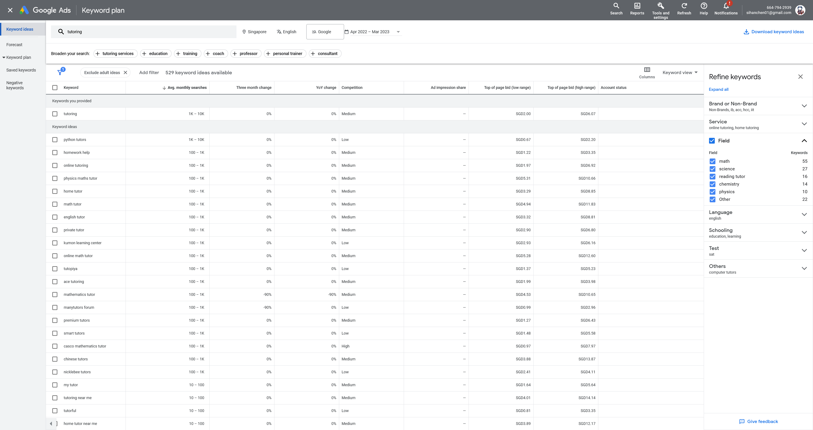
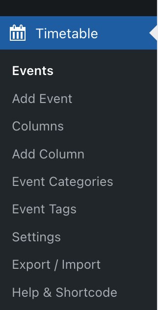

# Site

Provides instructions on to maintain/update website.

## Title
For the purpose of SEO -- increasing our rank on search engine, the title of our site should relate to treading topics.

After doing some research, we picked a few hot keywords (in Singapore) from 'python tutor', 'math tutor', 'science tutor', 'homework help', etc. 

*source: [Google Keyword Planner](https://ads.google.com/intl/en_sg/home/tools/keyword-planner/)

## Icon
icon image: `Center_Logo_1`

## Header
The Header section is composited of three parts: icon, menu, and social links. 

### Header Icon
Header [site icon](###icon) (Center_logo_1) height: 81px;

### Header Menu
Menu order: Home, About, Posts, Schedule, Registration 

## Popup
Using plugin [hustle](https://wordpress.org/plugins/wordpress-popup/) to create promotion popup. The popup is set to only shows on the 'Home' page, and the reset interval is set to every 3 minutes.

Popup Background Image:

## Pages

Before update or add any content on WordPress webiste, admins or authors will need to read and follow the rules stated below.

### General Rules
Steps to follow to add/update content:
1. For content creation, use accounts associated with one of those four roles: 'Author', 'Contributor', 'Editor', 'Subscriber'. Unless absolutely necessary, **do not** use 'Admin' account for creating new content.
2. Create backup at `live server` using [All-in-one WP Migration](https://wordpress.org/plugins/all-in-one-wp-migration/), and download backup file (**backup-old**).
3. Import **backup-old** into `localhost`, to set up localhost as `staging site`.
4. Test new content and make sure there are no conflict. After everything tested out, create a new backup file at localhost (**backup-new**).
5. Import **backup-new** into `live se plugin.ver` to migrate new content. Keep the **backup-old** for 30 days until deletion.

### Update Pages
There are five pages on our wordpress website, here are decriptions of how to make update on those pages:

#### Home
The Home Page utilizes the [Smart Slider 3] plugin. You can customize the smart slider 3 plugin by going to the Smart Slider section of the Admin Dashboard. Click on the Home Page slider to edit it. You can customize the slides or add new slides.

To modify the rest of the content, edit it from the Wordpress Page Editor.
#### About
TODO: how to update about page ...
#### Post
TODO: how to update post page ...
#### Schedule
For schedule site, we are using plugin [Timetable and Event Schedule](https://fr.wordpress.org/plugins/mp-timetable/) to create timetable. In WordPress admin page, go to plugin timetable

week days from Monday to Sunday are set as `Columns`. If user wishes to change timetable, edit `Events` to add or update course on timetable.

To update price table on courses, straightly edit tables in WordPress schedule page.

#### Registration
TODO: how to update registration page ...

