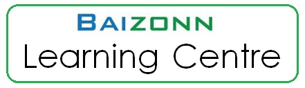

# Site

Provides instructions on to maintain/update website.

## Title
For the purpose of SEO -- increasing our rank on search engine, the title of our site should relate to treading topics.

After doing some research, we picked a few hot keywords (in Singapore) from 'python tutor', 'math tutor', 'science tutor', 'homework help', etc. 

*source: [Google Keyword Planner](https://ads.google.com/intl/en_sg/home/tools/keyword-planner/)

## Icon
icon image: `Center_Logo_1`

## Header
The Header section is composited of three parts: icon, menu, and social links. 

### Header Icon
Header [site icon](###icon) (Center_logo_1) height: 81px;

### Header Menu
Menu order: Home, About, Posts, Schedule, Registration 

## Popup
Using plugin [hustle](https://wordpress.org/plugins/wordpress-popup/) to create promotion popup. The popup is set to only shows on the 'Home' page, and the reset interval is set to every 3 minutes.

Popup Background Image:

## Pages
> Before update or add any content on WordPress webiste, admins or authors will need to read and follow [General Rules](deployment.md###General-Rules) in deployment.md for policies and guidelines.

There are five pages on our wordpress website, here are descriptions of how to make update on those pages:
#### Home
The Home Page utilizes the [Smart Slider 3](https://smartslider3.com/) plugin. You can customize the smart slider 3 plugin by going to the Smart Slider section of the Admin Dashboard. Click on the Home Page slider to edit it. You can customize the slides or add new slides.

To modify the rest of the content, edit it from the Wordpress Page Editor.
#### About
For about page, we are displaying information to help visitors get to know about Baizonn Learning Center. This is a page where we are introducing visitors with our lovely staff members; showing our history, values, goals and mottos; displaying awards that are marks of recognition of our professionalism and achievements; and providing customers with maps for three types of transportation vehicles (MRT, bus, and car).

#### Post
The post pages contains articles that are divided into two simple categories, **learning** and **events**. The **Learning** categories covers all the informative and spruce articles while **Events** category contains information surrounding the learning centre i.e. live events, open houses and parties... 

To update articles, visit the `post` option in the Wordpress Dashboard.
#### Schedule
For schedule site, we are using plugin [Timetable and Event Schedule](https://fr.wordpress.org/plugins/mp-timetable/) to create timetable. In WordPress admin page, go to plugin timetable

week days from Monday to Sunday are set as `Columns`. If user wishes to change timetable, edit `Events` to add or update course on timetable.

To update price table on courses, straightly edit tables in WordPress schedule page.

#### Registration
TODO: how to update registration page ...

