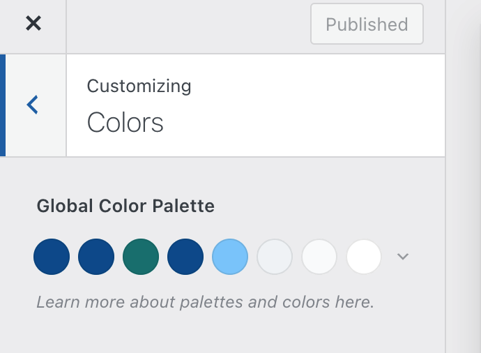

# Theme

## WP theme template
The theme we chose is [Blocksy](https://wordpress.org/themes/blocksy/), it only serves as a startup template, no more addon is used.

## Color 
### color paletee
```
--lapis-lazuli: #005b99ff;
--teal: #008080ff;
--celadon: #8fd8a0ff;
--light-green: #98ff98ff;
--light-sky-blue: #87cefaff;
```
### site color customization


From left to right:
- color 1: #005b99ff;
- color 2: #005b99ff;
- color 3: #008080ff;
- color 4: #005b99ff;
- color 5: #87cefaff;
- color 6: #f2f5f7;
- color 7: #fafbfc;
- color 8: #ffffff;

## Layout and Typography
- The content width is set between `70%` to `90%` on all pages;
- Separator margin (top & bottom): 6;
- H1 font size: default large (36px);
- H2 font size: 32px;
- For last component on each page, margin bottom: 6;
- Paragraph font size: default(16px);
